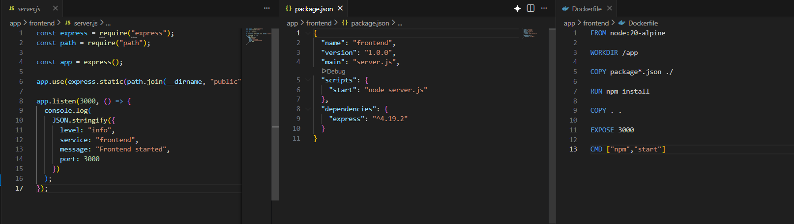
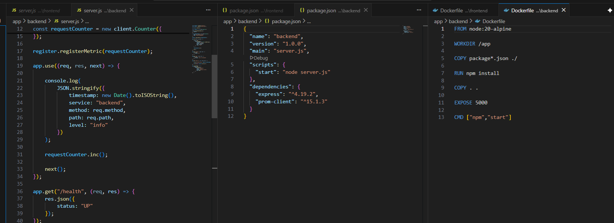
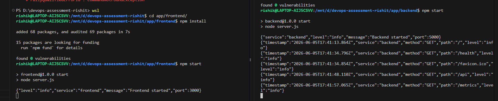
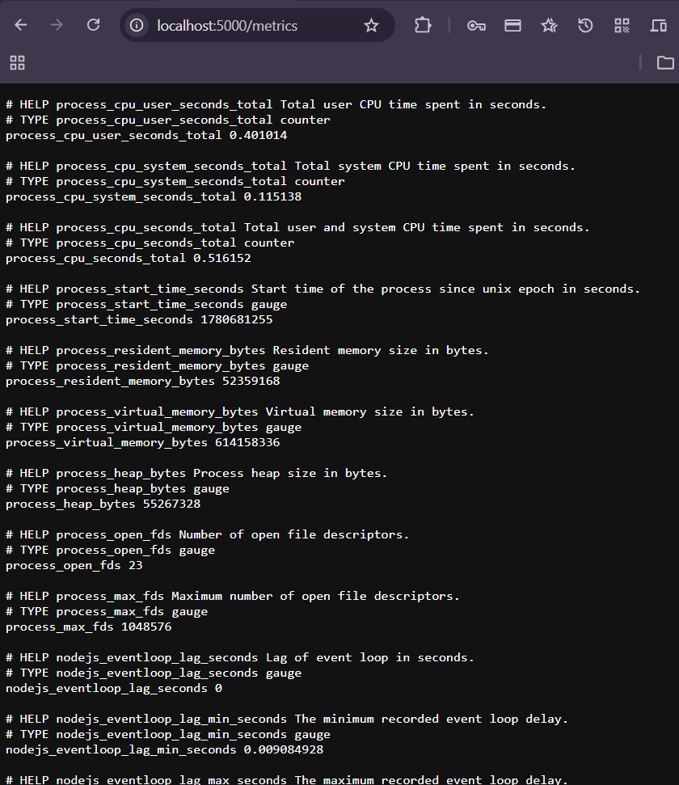
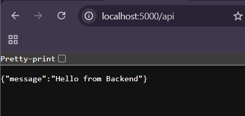
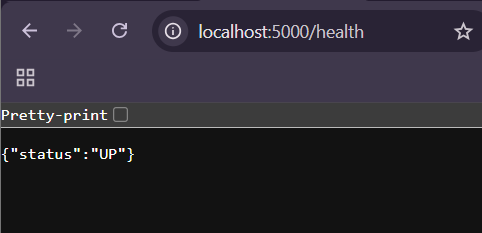
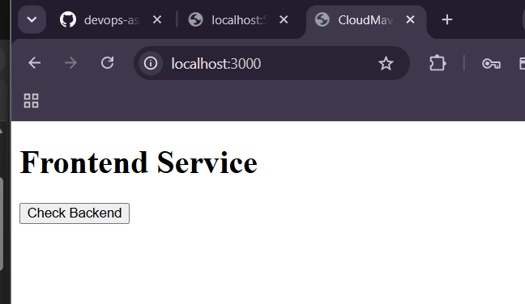

# project procedure

## firstly we will setup basic frontend and backend app and test that the vales it is providng or not

### frontend app

### Backend app

### now we will npm run and check all the things are working or not

### testing localhost that the vales are working or not

#### backend

#### frontend

##  now we will set all infrastructure and verify that they working or not

### before that we will firstly create s3 and db for backend and state locking